# 2025_ia651_bennett  -  Applied Machine Learning Final Project

### **Note:** *If you have the time, I reccomend just going through my .ipynbs in order (Model1 - Model 5), as I documented my thought process and "story" as I went, and it has much more context and "raw thoughts" than this overview...*

Source: https://www.kaggle.com/datasets/anirudhchauhan/retail-store-inventory-forecasting-dataset

***Collection Method:*** Unclear from the source, but it appears to be simulated or aggregated.

# Data Set Overview
**Date:** Daily records from [start_date] to [end_date].

**Store ID & Product ID:** Unique identifiers for stores and products.

**Category**: Product categories like Electronics, Clothing, Groceries, etc.

**Region**: Geographic region of the store.

**Inventory Level**: Stock available at the beginning of the day.

**Units Sold**: Units sold during the day.

**Units Ordered:** Units ordered that day for restocking

**Demand Forecast:** Predicted demand based on past trends.

**Price:** The price of 1 unit of the product (on that given day)

**Discount:** % discount applied to the product (that day) compared to the normal retail price.

**Weather Condition:** Daily weather impacting sales.

**Holiday/Promotion:** Indicators for holidays or promotions.

**Competitor Pricing:** Competitors pricing of 1 unit of the given product (on that given day)

**Seasonality:** Fall/Winter/Spring/Summer

---

**Project Goal:**
This project aims to predict future product demand (Units Sold) using historical operational and retail data.

**Practical Application:**
The demand forecast generated by this model can assist Supply Chain Managers, Operations staff, and Logistics professionals in making informed decisions regarding inventory management, resource allocation, and shipment planning, ultimately aiming to optimize stock levels and reduce costs, while maintaining an appropriate service level in the face of demand uncertainty.

# EDA 

How many observations? 
- Around 73000 

Feature Distributions 
- Because this data is either simulated or aggregated in some way, there aren't any glaringly problematic distributions in terms of imbalance or skew 

- Dist of Y
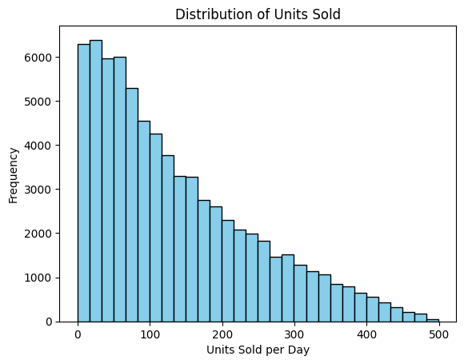

- Correlation Plot
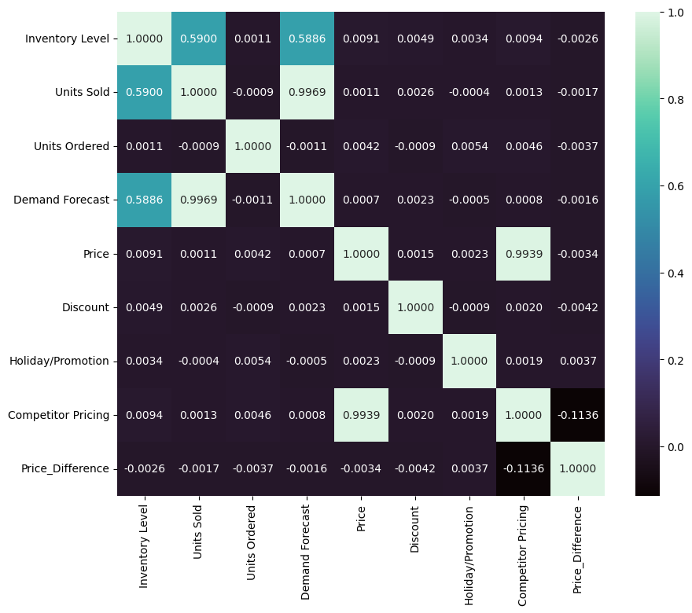

- Trend Exploration
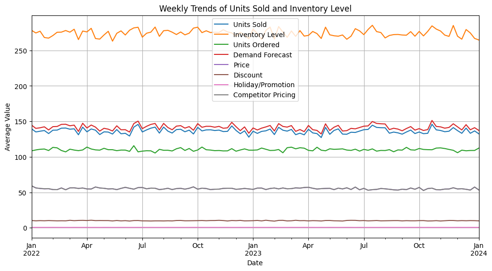
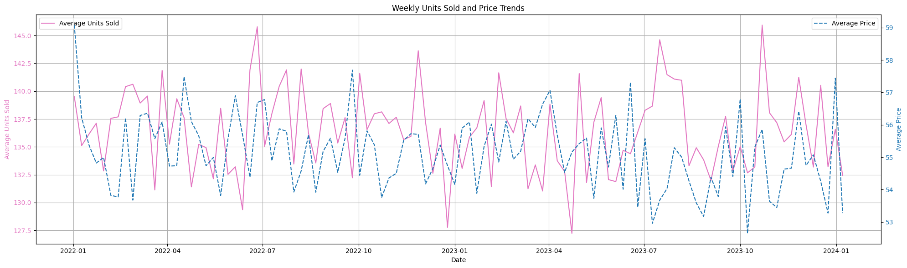
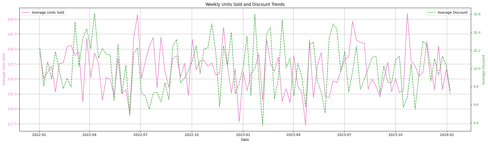
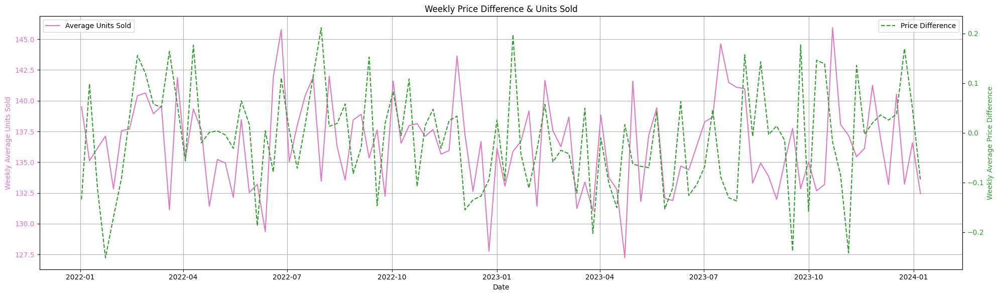
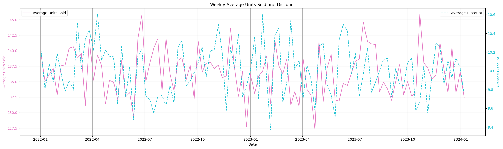
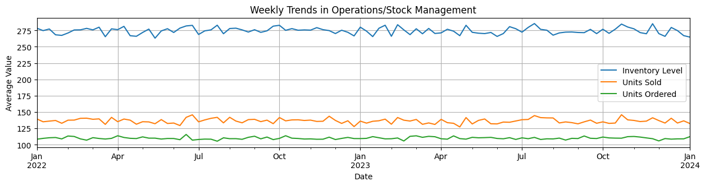
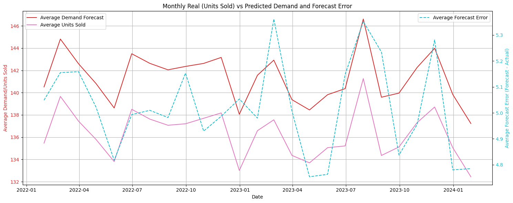
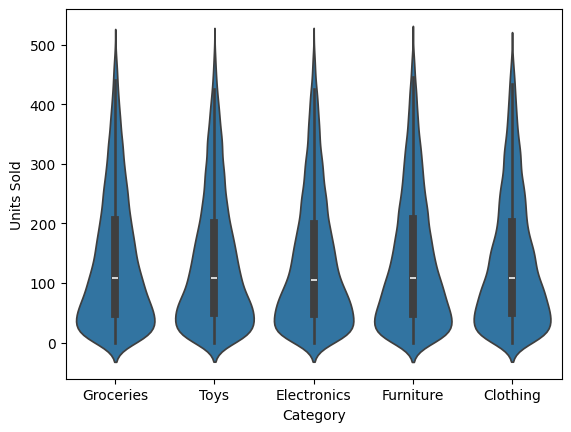
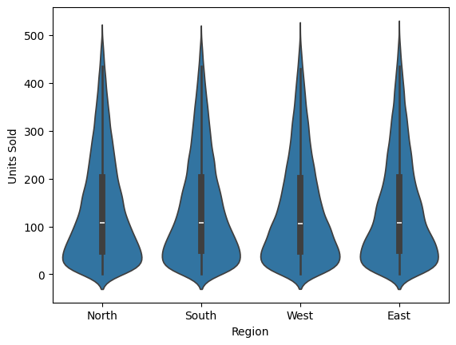

### Feature engineering

    data['Year'] = data.index.year

    data['Month'] = data.index.month

    data['Day'] = data.index.day

    data['DayOfWeek'] = data.index.dayofweek  (Monday=0, Sunday=6)

Created Features for Day of Week, Day of Month, Month and Year, because it's typical for there to be trends following these.

    data['Price_Difference'] = data['Price'] - data['Competitor Pricing']
Calculating the price difference between "our" product and competitors

#### Calculated some Supply-Chain/Logistics-relevant Features. (Did not use all of them, because I had to avoid data leakage, but wanted to create them all, in case my target variable changed at some point into the project.)

    data['Price_Discount_Ratio'] = data['Price'] / (data['Discount'] + 1)
Captures price sensitivity and promotion impact.

    data['Stock_to_Sales_Ratio'] = data['Inventory Level'] / data['Units Sold'].replace(0, np.nan)
Indicates how much inventory is held, relative to sales. Indicates overstock or understock situations.

    data['Sell_thru_Rate'] = data['Units Sold'] / (data['Units Sold'] + data['Inventory Level'])
Percentage of inventory sold to customers

    data['Backorder_Rate'] = (data['Units Ordered'] - data['Units Sold']) / data['Units Ordered'].replace(0, np.nan)
Proportion of orders not fulfilled immediately. A sign of demand exceeding supply.

    data['Order_Fulfillment_Rate'] = data['Units Sold'] / data['Units Ordered'].replace(0, np.nan)
Inverse of Backorder Rate. How well you are meeting customer demand. 

    data['Competitor_Price_Ratio'] = data['Price'] / data['Competitor Pricing'].replace(0, np.nan)
Measures price positioning vs. competitors.

    data['Demand_Forecast_Error'] = data['Units Sold'] - data['Demand Forecast']
Difference between predicted and actual Demand.

### Creating Lagged Features (VERY important for Demand Prediction)

    data['Previous_Day_Units_Sold'] = data.groupby(['Product ID', 'Store ID'])['Units Sold'].shift(1)
Lagged (by 1 day) Units Sold. "Yesterday's Sales". 

    data['7Day_RollingAvg_Units_Sold'] = data.groupby(['Product ID', 'Store ID'])['Units Sold'].rolling(window=7, min_periods=1).mean().reset_index(level=[0,1], drop=True)
7-day rolling mean of Units Sold

    data['7Day_RollingAvg_Inventory'] = data.groupby(['Product ID', 'Store ID'])['Inventory Level'].rolling(window=7, min_periods=1).mean().reset_index(level=[0, 1], drop=True)
7-day rolling average of Inventory Level

    data['Inventory_Turnover_Rate'] = data['Units Sold'] / (data['7Day_RollingAvg_Inventory'] + 1e-6)
A more stable Inventory Turnover rate, using the rolling average inventory...

    columns_to_check = ['Previous_Day_Units_Sold', 
                    '7Day_RollingAvg_Units_Sold', 
                    '7Day_RollingAvg_Inventory', 
                    'Inventory_Turnover_Rate']

    data.dropna(subset=columns_to_check, inplace=True)
**Dropped Rows with NaN in any of the Rolling Feature Columns:**
- dropna() with the 'subset' argument, makes sure we are ONLY dropping rows that were in the initial rows for each group. 

## Preprocessor:
    preprocessor = ColumnTransformer(
    transformers=[
        ('num', StandardScaler(), numerical_features),
        ('cat', OneHotEncoder(handle_unknown='ignore'), categorical_features) 
    ],
    remainder='drop')

## X-Variables: 
(Categorical were One Hot Encoded)

    categorical_features = [
    'Store ID', 'Product ID', 'Weather Condition', 'Holiday/Promotion',
    'Category', 'Region', 'Seasonality', 'Year', 'Month', 'Day', 'DayOfWeek']

    numerical_features = [
    'Inventory Level', 'Price_Discount_Ratio', 'Competitor_Price_Ratio',
    'Previous_Day_Units_Sold', '7Day_RollingAvg_Units_Sold', '7Day_RollingAvg_Inventory']

***With the target being 'Units Sold', to avoid data leakage, I didn't use any of my created features that referenced Units Sold in the calculation, or were closely correlated...***

## y-Variable: 
    'Units Sold'

## Model fitting

**This was a regression model, with the goal of predicting the units sold per day.**

Train Test Split (80/20):

    X_train, X_test, y_train, y_test = train_test_split(X, y, test_size=0.2, random_state=42)

I tested out many types of models...
    
    def create_pipeline(model):
    return Pipeline([
        ('preprocessor', preprocessor),
        ('regressor', model)
    ])
    
    models = {
        'Linear Regression': LinearRegression(),
        'Lasso': LassoCV(cv=5, max_iter=1000),
        'Ridge': RidgeCV(alphas=[0.1, 1, 10]),
        'Decision Tree': DecisionTreeRegressor(max_depth=5),
        'Random Forest': RandomForestRegressor(n_estimators=50, max_depth=10, random_state=42)
    }
    
    results = {}
        for name, model in models.items():
        pipeline = create_pipeline(model)
        pipeline.fit(X_train, y_train)
        y_pred = pipeline.predict(X_test)

    results[name] = {
        'RMSE': np.sqrt(mean_squared_error(y_test, y_pred)),
        'R^2': r2_score(y_test, y_pred)
    }
    
    pd.DataFrame(results).T

**I assumed Random Forest would perform the best, but my thought process was that it would still be good to try a basic Linear, Lasso, and Ridge Regression, as well as single Decision Tree, jus tto compare HOW much better a Random Forest would do.**

- What was the process for hyper parameter selection if applicable.  
- Any processes for searching for hyperparameters or ensemble approaches (e.g. cross fold validation, Gridsearch) should be outlined here.

# Performance

For all 5 models I utilized MSE and RMSE.

- They seemed like the best scoring metric because they effectively penalize major prediction mistakes, and RMSE particularly gives me a measure of the model(s) average error IN TERMS of units sold.

- I used R^2 to analyze how well the rgressions were capturing the variance of the data.

## *End of Processes that apply to all 5 models....* 
---
---
---
---
---
---

# Model 1 - Full Data Set "Units Sold" Prediction

### Validation / metrics

Here were the results of Model 1, from my multi-model pipeline:
    

<table border="1" class="dataframe">
  <thead>
    <tr style="text-align: right;">
      <th></th>
      <th>RMSE</th>
      <th>R^2</th>
    </tr>
  </thead>
  <tbody>
    <tr>
      <th>Linear Regression</th>
      <td>81.082932</td>
      <td>0.448492</td>
    </tr>
    <tr>
      <th>Lasso</th>
      <td>81.039445</td>
      <td>0.449083</td>
    </tr>
    <tr>
      <th>Ridge</th>
      <td>81.082423</td>
      <td>0.448499</td>
    </tr>
    <tr>
      <th>Decision Tree</th>
      <td>80.771373</td>
      <td>0.452722</td>
    </tr>
    <tr>
      <th>Random Forest</th>
      <td>77.636791</td>
      <td>0.494375</td>
    </tr>
  </tbody>
</table>

### Grid Search for Optimal Hyperparameters of Random Forest:
    # Grid Search
    param_grid_rf = {
    'regressor__n_estimators': [50, 100],
    'regressor__max_depth': [5, 10],
    'regressor__min_samples_split': [2],
    'regressor__min_samples_leaf': [1],  
    }

    pipeline_rf = Pipeline([
        ('preprocessor', preprocessor),
        ('regressor', RandomForestRegressor(random_state=42))
    ])

    grid_search_rf = GridSearchCV(pipeline_rf, param_grid_rf, cv=3, scoring='neg_root_mean_squared_error', verbose=1, n_jobs=-1)
    grid_search_rf.fit(X_train, y_train)

    # Grabing the best parameters and score

    best_params_rf = grid_search_rf.best_params_
    best_rmse_rf = -grid_search_rf.best_score_ # Converting back to positive RMSE

    print("Best Hyperparameters for Random Forest:", best_params_rf)
    print("Best RMSE on Cross-Validation:", best_rmse_rf)

    # Evaluating the best model on the test set
    best_rf_model = grid_search_rf.best_estimator_
    y_pred_rf_tuned = best_rf_model.predict(X_test)

    rmse_rf_tuned_test = np.sqrt(mean_squared_error(y_test, y_pred_rf_tuned))
    r2_rf_tuned_test = r2_score(y_test, y_pred_rf_tuned)

    print("Performance of Tuned Random Forest on Test Set:")
    print(f"RMSE: {rmse_rf_tuned_test:.4f}")
    print(f"R^2: {r2_rf_tuned_test:.4f}")

### Results for Model 1:
    Best RMSE on Cross-Validation: 77.36036103120777
    Performance of Tuned Random Forest on Test Set:
    RMSE: 77.5584
    R^2: 0.4954

### Performance 

The hyperparameter-tuned Random Forest for Model 1 has an R^2 of 0.4954, which means it's only explaining a little less than 50% of variance in Units Sold...

## Model 2 - Product #1 "Units Sold" Prediction

***Ran the same process as in model 1, but for the subset of the data that was just Product #1***

    product_p0001_df = data[data['Product ID'] == 'P0001']

### Validation / metrics

Here were the results of Model 2, from my multi-model pipeline:

<table border="1" class="dataframe">
  <thead>
    <tr style="text-align: right;">
      <th></th>
      <th>RMSE</th>
      <th>R^2</th>
    </tr>
  </thead>
  <tbody>
    <tr>
      <th>Linear Regression</th>
      <td>82.197775</td>
      <td>0.444990</td>
    </tr>
    <tr>
      <th>Lasso</th>
      <td>81.229276</td>
      <td>0.457992</td>
    </tr>
    <tr>
      <th>Ridge</th>
      <td>82.078755</td>
      <td>0.446596</td>
    </tr>
    <tr>
      <th>Decision Tree</th>
      <td>82.938695</td>
      <td>0.434939</td>
    </tr>
    <tr>
      <th>Random Forest</th>
      <td>81.095400</td>
      <td>0.459777</td>
    </tr>
  </tbody>
</table>

### Results after Grid Search for Optimal Hyperparameters of Random Forest:
    Best RMSE on Cross-Validation: 79.58243339527549
    Performance of Tuned Random Forest on Test Set:
    RMSE: 79.8124
    R^2: 0.4767

### Performance & Over/Underfitting Concerns

The R^2 was slightly worse than the full dataset in Model 1... about 47% of variance captured. I was surprised by this because I assumed a smaller more consistent dataset would be easier to "learn"

## Model 3 - Store #1 "Units Sold" Prediction

***Ran the same process as in model 1, but for the subset of the data that was just Product #1***

    store_S001_df = data[data['Store ID'] == 'S001']

### Validation / metrics

Here were the results of Model 1, from my multi-model pipeline:

<table border="1" class="dataframe">
  <thead>
    <tr style="text-align: right;">
      <th></th>
      <th>RMSE</th>
      <th>R^2</th>
    </tr>
  </thead>
  <tbody>
    <tr>
      <th>Linear Regression</th>
      <td>81.131944</td>
      <td>0.460366</td>
    </tr>
    <tr>
      <th>Lasso</th>
      <td>80.774544</td>
      <td>0.465110</td>
    </tr>
    <tr>
      <th>Ridge</th>
      <td>81.118092</td>
      <td>0.460550</td>
    </tr>
    <tr>
      <th>Decision Tree</th>
      <td>82.419980</td>
      <td>0.443095</td>
    </tr>
    <tr>
      <th>Random Forest</th>
      <td>78.628228</td>
      <td>0.493158</td>
    </tr>
  </tbody>
</table>

### Resuls after Grid Search for Optimal Hyperparameters of Random Forest:
    Best RMSE on Cross-Validation: 77.6189588567931
    Performance of Tuned Random Forest on Test Set:
    RMSE: 78.5019
    R^2: 0.4948

### Performance & Over/Underfitting Concerns

The R^2 was about the same as the full dataset in Model 1... about 49.5% of variance captured. I was still surprised that this wasn't better than model 1, because since it was focused on a single physical store, I assumed that it would in essence be a true "mini' version of model 1, which was essentially this data x5 different stores, with their own trends.

## Model 4 - Product 1 @ Store 1 "Units Sold" Prediction

***Ran the same process as in model 1, but for the even smaller subset of the data that was just Product #1, from Store #1***
    
    store1_product1_df = data[(data['Store ID'] == 'S001') & (data['Product ID'] == 'P0001')]

### Validation / metrics

Here were the results of Model 1, from my multi-model pipeline:

<table border="1" class="dataframe">
  <thead>
    <tr style="text-align: right;">
      <th></th>
      <th>RMSE</th>
      <th>R^2</th>
    </tr>
  </thead>
  <tbody>
    <tr>
      <th>Linear Regression</th>
      <td>86.709359</td>
      <td>0.319968</td>
    </tr>
    <tr>
      <th>Lasso</th>
      <td>83.437554</td>
      <td>0.370319</td>
    </tr>
    <tr>
      <th>Ridge</th>
      <td>86.155024</td>
      <td>0.328635</td>
    </tr>
    <tr>
      <th>Decision Tree</th>
      <td>96.358307</td>
      <td>0.160200</td>
    </tr>
    <tr>
      <th>Random Forest</th>
      <td>90.294904</td>
      <td>0.262565</td>
    </tr>
  </tbody>
</table>

    

### Results after Grid Search for Optimal Hyperparameters of Random Forest:

    Best Hyperparameters for Random Forest: {'regressor__max_depth': 5, 'regressor__min_samples_leaf': 1, 'regressor__min_samples_split': 2, 'regressor__n_estimators': 100}
    Best RMSE on Cross-Validation: 78.65225662190643
    Performance of Tuned Random Forest on Test Set:
    RMSE: 90.3262
    R^2: 0.2621

### Performance Concerns

This was really quite shocking, at first, because it is a very specific subset that I assumed would have it's own strong trends... however the models really struggled to capture the variance. However, given that this slicing of data has SIGNIFICANTLY reduced the number of observations for modeling, part of me wonders if that's the primary reason why the R^2 was ~26%...

# Model 5 - Fitting a Neural Nework(s) for Regression on the FULL Data Set (Like Model 1)

    # Calculating Split Points
    n = len(data)
    n_train = int(n * 0.80)
    n_val = int(n * 0.10)
    # n_test = n - n_train - n_val
    # test_size_pct is implicitly the 10% left after those two.

    # Chronological Split
    train_data = data.iloc[:n_train]
    val_data = data.iloc[n_train : n_train + n_val]
    test_data = data.iloc[n_train + n_val :]

    # Separating all the Features and the Target for EACH set of data
    X_train = train_data[features]
    y_train = train_data[target_variable]

    X_val = val_data[features]
    y_val = val_data[target_variable]

    X_test = test_data[features]
    y_test = test_data[target_variable]

    # Fiting the preprocessor on JUST the training data
    X_train_processed = preprocessor.fit_transform(X_train)

    # Transforming validation and test data
    X_val_processed = preprocessor.transform(X_val)
    X_test_processed = preprocessor.transform(X_test)

    # Converting the sparse matrix output (from One hot encoding) to a dense NumPy array
    if hasattr(X_train_processed, "toarray"):
        X_train_processed = X_train_processed.toarray()
        X_val_processed = X_val_processed.toarray()
        X_test_processed = X_test_processed.toarray() 

    print(f"Shape of processed X_train: {X_train_processed.shape}")
    print(f"Shape of processed X_val: {X_val_processed.shape}")
    print(f"Shape of processed X_test: {X_test_processed.shape}")

    # Make sure y sets are NumPy arrays
    y_train_np = y_train.values
    y_val_np = y_val.values
    y_test_np = y_test.values

### **Base Model**
    # Define/Compiling the Keras Model

    tf.random.set_seed(42)

    # Getting the number of features AFTER preprocessing
    n_features_processed = X_train_processed.shape[1]

    # Input Layer - shape needs to match the processed data...
    input_layer = Input(shape=(n_features_processed,))

    # Model
    model = Sequential([
        input_layer,
        Dense(10, activation="relu"),   # Single Dense Layer w/ 10 Neurons and ReLU activation
        Dense(1)                        # Single Neuron Output Layer (for Regression)
    ])

    # Compiling the model
    optimizer = tf.keras.optimizers.Adam(learning_rate=1e-3)
    model.compile(loss="mse",
                optimizer=optimizer,
                metrics=[RootMeanSquaredError()])

    # Defining Callbacks & Training the Model

    early_stopping = EarlyStopping(monitor='val_loss', # Monitoring validation loss
                                patience=5,    # Stop training if no improvement after 5 epochs
                                restore_best_weights=True) # Keep the best model weights found

    history = model.fit(
        X_train_processed, # Processed training features
        y_train_np,        # Training targets
        epochs=100,
        validation_data=(X_val_processed, y_val_np), # Use processed validation features
        callbacks=[early_stopping],
        verbose=1
    )

    # Evaluating it's performance
    val_loss, val_rmse = model.evaluate(X_val_processed, y_val_np, verbose=0)

    print(f"\nValidation MSE (from evaluate): {val_loss:.4f}")
    print(f"Validation RMSE (from evaluate): {val_rmse:.4f}")

    # Ploting the learning curves
    pd.DataFrame(history.history).plot(figsize=(8, 5))
    plt.grid(True)
    plt.gca().set_ylim(0, max(history.history['loss'] + history.history['val_loss']))
    plt.show()

### Results of Base Model:

    Validation MSE (from evaluate): 5973.7461
    Validation RMSE (from evaluate): 77.2900

This was a good sign that a NN could capture more variance in the data than a Regression Alorithm or Random Forest, because it's RMSE was already equivalent to the best performing RF model with just a single dense base layer with 10 Neurons. 

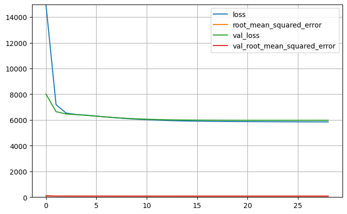
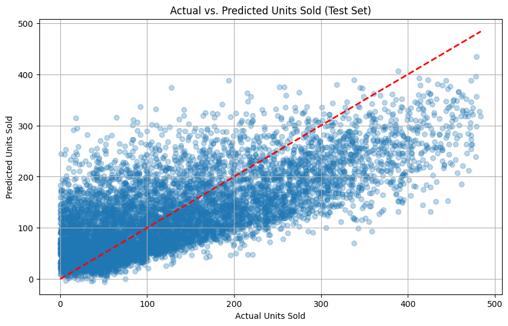

### *Variations I tried next:*
- Model 1a - Dense Layer with 50 neurons and ReLU activation

- Model 1b - Dense Layer with 50 neurons, ReLU activation, Dropout(0.3)

- Model 2a - Dense Layer with 100 neurons and ReLU activation

- Model 2b - Dense Layer with 100 neurons, ReLU activation, Dropout(0.3)

**After trying these, it became clear that Increasing the # of Neurons in the base layer didn't seem to improve the RMSE much at all, so I moved on to deeper networks**

- Model 3a - 2 Dense Layer's with 10 neurons each and ReLU activation

- Model 3b - 2 Dense Layer's with 10 neurons each, ReLU activation, Dropout(0.3)

- Model 3c - 2 Dense Layer's (100->10 neurons), ReLU activation, Dropout(0.3)

- Model 3d - 3 Dense Layer's (100->10->10 neurons), ReLU activation, Dropout(0.3)

After experimenting with wider and deeper networks, with and without dropout, the best combo I found was: **Model 2b - Dense Layer with 100 neurons, ReLU activation, Dropout(0.3)**

Scores:
    
    Validation **MSE: 5924.1602**
    Validation **RMSE: 76.9686**

Let's make that our new "Base" model, and experiment with Hyperparameters: ***Dropout Rate, Learning Rate, Activation Function and Batch Size.***

*(Going Deeper and Wider weren't having much of an impact so far, so I tried tuning hyperparameters next)*

### *Combos I tried next:*

- Trial 1.1 - Dropout(0.2)
 
- Trial 1.2 - Dropout(0.4)
 
- Trial 1.3 - Dropout(0.5)

- Trial 2.1 - Learning Rate = 3e-4 (0.0003), Dropout(0.3)

- Trial 2.2 - Learning Rate = 1e-4 (0.0001), Dropout(0.3)

- Trial 3 - tanh activation

- Trial 4a - Batch Normalization + Activation + Dropout

- Trial 4b - Batch Normalization + Activation (NO Dropout)

- Trial 5a - L2 (Ridge) Regularizaion

- Trial 5b - L1 (Lasso) Regularizaion

- **Trial 6a - Batch Size = 16**

- Trial 6b - Batch Size = 64

- Trial 6c - Batch Size = 128

### *The BEST Neural Network Configuration I found was Trial 6a:*

**Architecture: Input -> Dense(100, activation='relu') -> Dropout(0.3) -> Dense(1)**

**Optimizer: Adam(learning_rate=1e-3)**

**Training Batch Size: 16**

Results of Trial 6a:

    Validation MSE (from evaluate): 5896.1704
    Validation RMSE (from evaluate): 76.7865

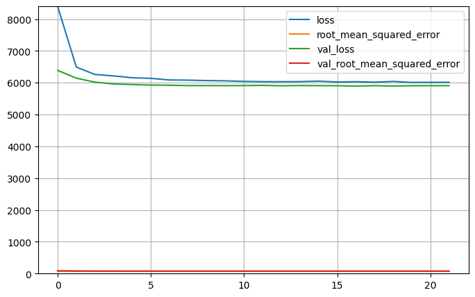

### However, unfortunately after all that work, the result isn't much better than the Random Forests I trained earlier... so it seem's we've hit a performance plateau/wall with trying to model this dataset...

---
---
---
---
---
---

## *Analysis of Acceptability (for the Neural Networks... but really for ALL the Models, because the results were honestly the same for all of them (except model 4, which was QUITE bad...)*

#### RMSE vs. Mean/Median:

- The average daily sales (mean) is ~136 units.
- The median daily sales (50%) is 107 units (meaning half the time, sales are 107 units or less).

The model's average error (RMSE) is ~77.8 units.
- Relative Error (vs. Mean): 77.8 / 136.4 = 0.57 or ~57%.
- Relative Error (vs. Median): 77.8 / 107.0 = 0.73 or ~73%.

...This is pretty high. **This models average prediction error is more than half the value of the average daily sales.**

#### RMSE vs. Standard Deviation:

- The standard deviation is ~109 units. ***That is quite a significant spread in daily sales numbers...***
- The model's RMSE (77.8) is smaller than the standard deviation... 

**This is good, because it confirms the model is learning something and *performs better than just predicting the average sales every day.***

...however, the RMSE is still about ~71% of the standard deviation... which suggests ***a large portion of the variability in sales is unfortunately NOT being captured by the model :/***

#### RMSE vs. Interquartile Range (IQR):

- The IQR (spread of the middle 50% of daily sales) is 202 - 48 = 154 units.
- The RMSE is about ~50% of the IQR.

...So, the **average error** of the model is **roughly half the typical range** seen in the bulk of the 2 year timespan of this data.

## Conclusion:

**A Test RMSE of ~77.8, for this data, appears VERY high and is likely NOT acceptable for practical Supply Chain/Operations/Inventory management purposes... :/**

- The *error is a VERY large percentage of the mean/median* sales values.
- While **better than guessing** the average (compared to the standard deviation and IQR), it *still represents a large amount of unexplained variance.*

**An average error this large could lead to significant inaccuracies in ordering, potentially causing frequent overstocking or stockouts, depending on how the forecast is used...**
#### **So I'd reccomend using either of these models as sort of a "compass", to point you (the Inventory Manager) in "a" direction, but then using your intuition and gut to make your real guess.**

# Underfitting Concerns...

Unfortuntely, since all the models showed nearly identical performance/struggled to handle such a high variance target (std of Units Sold was 108.92) DESPITE my best efforts to tune and optimize them, I can only assume there was a lot of bias and underfitting going on...

There's also a good chance I was experiencing the curse of dimensionality first-hand... as after I went back to kaggle a few days ago to see how others documented and handled the same data, I saw that others had much better success when they kept the models simple, and didn't engineer/create as many new features as I did. The most I saw some others do was just the simple 1-day-lagged Units Sold feature ("yesterdays sales"), and they had RMSE of ~16, and R^2 in the high 90's...

But alas, I should've known I tend to make things more complicated than neccesary... lesson learned!

# Going further

More advanced time series techniques seem like they would be the best kind of models for this type of problem. in particular, RNN's with LSTM seem like they'd be very useful for capturing trends and factoring them in to make forecasts more accurate.

The whole point of me working with this dataset in particular was to play around with building a Demand forecast, since it is potentially something I can do at my internship this summer, or in my career. After seeing how poorly these models did (although still better than just guessing!), I've definetrly learned that this probably would've gone better with time-series techniques. 

So in the future when I'm facing this type of problem (hopefully this summer), I will do the best I can to teach myself how to properly implement time-series models.

(And I will of course report back to you next semester... regardless of how good or bad it goes!)  :)